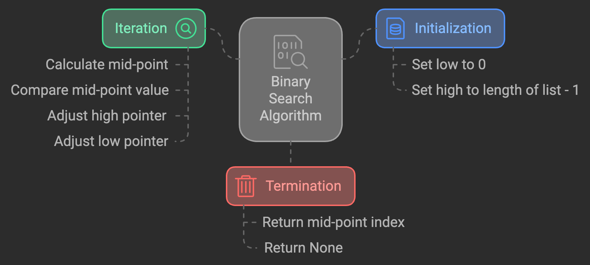

# Python Algorithms Project

This project contains implementations of various algorithms in Python. Each algorithm is implemented in a separate file for clarity and ease of use.

## Algorithms

### 1. Binary Search
- **File:** `001_binary_search.py`
- **Description:** This algorithm finds the position of a target value within a sorted array. It compares the target value to the middle element of the array.
- **Time Complexity:** O(log n)
- 

### 2. Selection Sort
- **File:** `002_selection_sort.py`
- **Description:** This algorithm sorts an array by repeatedly finding the smallest element from the unsorted part and putting it at the beginning.
- **Time Complexity:** O(n^2)

### 3. Recursive Sum
- **File:** `003_recursive_sum.py`
- **Description:** This algorithm calculates the sum of all elements in an array using recursion.
- **Time Complexity:** O(n)

### 4. Recursive Count
- **File:** `003_recursive_sum.py`
- **Description:** This algorithm counts the number of elements in an array using recursion.
- **Time Complexity:** O(n)

### 5. Recursive Max
- **File:** `003_recursive_sum.py`
- **Description:** This algorithm finds the maximum value in an array using recursion.
- **Time Complexity:** O(n)

### 6. Quick Sort
- **File:** `004_quick_sort.py`
- **Description:** This algorithm sorts an array by dividing it into smaller sub-arrays based on a pivot element and recursively sorting the sub-arrays.
- **Time Complexity:** O(n log n) on average

## Usage

To run any of the algorithms, simply execute the corresponding Python file. For example, to run the selection sort algorithm:

```sh
python 002_selection_sort.py
```
## Requirements

- Python 3.x

## License

This project is licensed under the MIT License.